<div align="center">


<br>

<!-- Dynamic Badges with Animations -->
<p align="center">
  
  
  
  
</p>

<p align="center">
  
  
  
  
</p>

<!-- Live Status Indicators -->
<p align="center">
  
  
  
  
</p>

---

## 🌟 What is Instagram Unfollower Checker?

<table>
<tr>
<td width="50%">

### 🌟 **The Ultimate Instagram Analytics Tool**

A **next-generation**, **privacy-obsessed** Instagram analytics platform that revolutionizes how you understand your social media presence:

 **Discover Unfollowers** - AI-powered detection  
 **Analyze Engagement** - Deep insights & metrics  
 **Track Growth** - Historical trend analysis  
 **Export Results** - Beautiful, shareable reports  

</td>
<td width="50%">

<div align="center">


**✨ Real-time Processing • 🚀 Zero Latency • 🔐 Bank-level Security**
</div>

</td>
</tr>
</table>

### 🏆 **Why Choose Our Tool?**

<details>
<summary>🎨 <strong>Modern UI/UX Design</strong></summary>
<br>
<blockquote>
Built with the latest design principles, featuring glassmorphism, smooth animations, and an intuitive interface that makes analytics fun and engaging.
</blockquote>
</details>

<details>
<summary>⚡ <strong>Lightning Performance</strong></summary>
<br>
<blockquote>
Powered by Vite and modern JavaScript, our tool processes thousands of followers in milliseconds with zero server round-trips.
</blockquote>
</details>

<details>
<summary>🔒 <strong>Privacy by Design</strong></summary>
<br>
<blockquote>
Your data never leaves your device. We've built this tool with privacy as the core principle - no tracking, no storage, no compromise.
</blockquote>
</details>

</div>

## ✨ Features & Capabilities

<div align="center">

</div>

<table>
  <tr>
    <td align="center" width="25%">
      
      <h3>🔐 Fort Knox Security</h3>
      <p><strong>Zero-Knowledge Architecture</strong></p>
      <p><small>Military-grade client-side processing<br>Your data never sees the internet</small></p>
      
    </td>
    <td align="center" width="25%">
      
      <h3>⚡ Quantum Speed</h3>
      <p><strong>Sub-Second Analysis</strong></p>
      <p><small>Modern algorithms & optimizations<br>Process 100K+ followers instantly</small></p>
      
    </td>
    <td align="center" width="25%">
      
      <h3>💎 Forever Free</h3>
      <p><strong>No Hidden Agenda</strong></p>
      <p><small>Open source transparency<br>No premium plans or paywalls</small></p>
      
    </td>
    <td align="center" width="25%">
      
      <h3>🚀 Zero Friction</h3>
      <p><strong>Upload & Analyze</strong></p>
      <p><small>No accounts, no emails<br>Just drag, drop, and discover</small></p>
      
    </td>
  </tr>
</table>

### 🎯 **Advanced Analytics Features**


<div align="center">

| 🎨 **UI Features** | 📊 **Analytics** | 🔧 **Technical** | 🌟 **Unique** |
|:------------------:|:----------------:|:-----------------:|:--------------:|
| Dark/Light Mode | Real-time Charts | PWA Support | AI Insights |
| Responsive Design | Export Options | Offline Capable | Trend Prediction |
| Smooth Animations | Data Visualization | Edge Computing | Smart Filtering |
| Accessibility | Historical Tracking | WebAssembly | Custom Reports |

</div>

## 🚀 Quick Start Guide

<div align="center">

</div>

### 👥 **For Users** 

<table>
<tr>
<td width="33%" align="center">

#### 📱 **Step 1: Export Data**


```bash
Instagram → Settings → 
Privacy → Data Download → 
Request Data (JSON Format)
```
<sub>⏱️ Takes 24-48 hours</sub>

</td>
<td width="33%" align="center">

#### 🌐 **Step 2: Visit Tool**


```bash
🔗 https://your-app.vercel.app
```
<sub>⚡ Instant access, no signup</sub>

</td>
<td width="33%" align="center">

#### 📊 **Step 3: Analyze**


```bash
Drag & Drop Files →
Instant Results 🎉
```
<sub>🔒 100% client-side processing</sub>

</td>
</tr>
</table>

> 💡 **Pro Tip:** Bookmark our tool for future analysis sessions!

### 👨‍💻 **For Developers**

<details>
<summary>🛠️ <strong>Development Environment Setup</strong></summary>

#### 🔧 **Prerequisites**
```bash
# Required versions
Node.js ≥ 18.0.0
npm ≥ 8.0.0 (or yarn ≥ 1.22.0)
Git ≥ 2.34.0
```

#### ⚡ **Lightning Setup**
```bash
# 🚀 One-command setup
curl -sSL https://raw.githubusercontent.com/AAYUSH412/insta-unfollower-check/main/scripts/setup.sh | bash

# 📁 Manual setup
git clone https://github.com/AAYUSH412/insta-unfollower-check.git
cd insta-unfollower-check/frontend
npm install
npm run dev
```

#### 🏗️ **Build Pipeline**
```bash
# Development
npm run dev          # Start dev server
npm run build        # Production build
npm run preview      # Preview build
npm run lint         # Code linting
npm run test         # Run tests
```

#### 🚀 **Deployment Options**
<table>
<tr>
<td align="center"></td>
<td align="center"></td>
<td align="center"></td>
</tr>
<tr>
<td align="center">Recommended</td>
<td align="center">Fast CDN</td>
<td align="center">Free Hosting</td>
</tr>
</table>

</details>

## 🎯 Architecture & How It Works

<div align="center">

</div>

### 🏗️ **System Architecture**

```mermaid
graph TB
    subgraph "Client Browser"
        A[📱 Instagram Data Files] --> B[� File Parser]
        B --> C[⚡ Processing Engine]
        C --> D[🧮 Analytics Core]
        D --> E[📊 Visualization Layer]
        E --> F[🎨 React UI Components]
    end
    
    subgraph "Security Layer"
        G[🔐 Zero-Knowledge Processing]
        H[🛡️ Client-Side Encryption]
        I[🚫 No Network Calls]
    end
    
    C -.-> G
    C -.-> H
    C -.-> I
    
    style A fill:#ff6b6b
    style F fill:#4ecdc4
    style G fill:#45b7d1
```



### ⚙️ **Processing Pipeline**

<table>
<tr>
<td width="20%" align="center">

#### � **Input**


JSON Files
- `followers_1.json`
- `following.json`

</td>
<td width="20%" align="center">

#### 🔍 **Parse**


Data Extraction
- Schema validation
- Error handling

</td>
<td width="20%" align="center">

#### 🧮 **Analyze**


Set Operations
- Intersections
- Differences

</td>
<td width="20%" align="center">

#### 📊 **Visualize**


Real-time Charts
- Interactive graphs
- Export options

</td>
<td width="20%" align="center">

#### 🎯 **Export**


Results
- CSV/JSON export
- Shareable reports

</td>
</tr>
</table>

### ⚙️ **Algorithm Details**

<details>
<summary>🧠 <strong>Core Algorithms</strong></summary>

```javascript
// Unfollower Detection Algorithm
const findUnfollowers = (followers, following) => {
  const followersSet = new Set(followers.map(f => f.username));
  const followingSet = new Set(following.map(f => f.username));
  
  return {
    unfollowers: [...followingSet].filter(x => !followersSet.has(x)),
    nonFollowers: [...followingSet].filter(x => !followersSet.has(x)),
    mutualFollows: [...followersSet].filter(x => followingSet.has(x))
  };
};
```

**Time Complexity:** O(n + m) where n = followers, m = following  
**Space Complexity:** O(n + m)  
**Performance:** Processes 100K+ followers in <500ms
</details>

## ❇️ Tech Stack & Dependencies

<div align="center">

</div>

### 🏗️ **Architecture Stack**

<table>
<tr>
<td align="center" width="25%">

#### 🎨 **Frontend**


</td>
<td align="center" width="25%">

#### 💅 **Styling**


</td>
<td align="center" width="25%">

#### ⚡ **Build Tools**


</td>
<td align="center" width="25%">

#### 🚀 **Deployment**


</td>
</tr>
</table>

### 📦 **Key Dependencies**

<details>
<summary>🎯 <strong>Production Dependencies</strong></summary>

```json
{
  "react": "^19.1.1",                    // UI Framework
  "react-dom": "^19.1.1",               // DOM Rendering
  "react-router-dom": "^7.8.0",         // Client Routing
  "@heroicons/react": "^2.2.0",         // Icon Library
  "lucide-react": "^0.539.0",           // Modern Icons
  "@tailwindcss/vite": "^4.1.11",       // CSS Framework
  "@vercel/speed-insights": "^1.2.0"    // Performance Monitoring
}
```
</details>

<details>
<summary>🔧 <strong>Development Dependencies</strong></summary>

```json
{
  "@vitejs/plugin-react": "^4.7.0",     // React Plugin
  "eslint": "^9.33.0",                  // Code Linting
  "eslint-plugin-react": "^7.37.5",     // React Rules
  "eslint-plugin-react-hooks": "^5.2.0", // Hooks Rules
  "terser": "^5.43.1",                  // Code Minification
  "vite": "^6.3.5"                      // Build Tool
}
```
</details>

### 🎯 **Performance Metrics**

<div align="center">

| Metric | Score | Tool |
|:------:|:-----:|:----:|
| **Performance** |  | Lighthouse |
| **Accessibility** |  | Lighthouse |
| **Best Practices** |  | Lighthouse |
| **SEO** |  | Lighthouse |
| **Bundle Size** |  | Bundlephobia |
| **Load Time** |  | PageSpeed |

</div>

### 🔮 **Future Tech Integrations**

- [ ] 🦀 **WebAssembly** for ultra-fast processing
- [ ] 🧠 **Machine Learning** for smart insights
- [ ] 📱 **Progressive Web App** capabilities
- [ ] ⚡ **Edge Computing** with Vercel Functions
- [ ] 🎨 **3D Visualizations** with Three.js
- [ ] 🔄 **Real-time Updates** with WebSockets

## 🖵 Screenshots & Demo

<div align="center">

</div>

### 🎬 **Interactive Demo**

<table>
<tr>
<td width="50%" align="center">

#### 🖥️ **Desktop Experience**


**Modern UI with glassmorphism effects**
- Smooth animations & transitions
- Dark/Light theme support
- Responsive design patterns

</td>
<td width="50%" align="center">

#### 📱 **Mobile Experience**


**Touch-optimized interface**
- Swipe gestures
- Mobile-first design
- PWA capabilities

</td>
</tr>
</table>

### 🎯 **Feature Showcase**

<details>
<summary>📊 <strong>Analytics Dashboard</strong></summary>
<br>
<div align="center">

<br><br>
<em>Real-time charts and interactive visualizations</em>
</div>
</details>

<details>
<summary>🕵️ <strong>Unfollower Detection</strong></summary>
<br>
<div align="center">

<br><br>
<em>Instantly identify who unfollowed you with smart filtering</em>
</div>
</details>

<details>
<summary>📈 <strong>Growth Tracking</strong></summary>
<br>
<div align="center">

<br><br>
<em>Historical data and trend analysis</em>
</div>
</details>

### 🎨 **UI Components Gallery**

<div align="center">

| Component | Preview | Features |
|:---------:|:-------:|:--------:|
| **Upload Zone** |  | Drag & Drop, Progress Bar |
| **Data Cards** |  | Animated Stats, Hover Effects |
| **Charts** |  | Interactive, Real-time Updates |
| **Tables** |  | Sortable, Filterable, Export |

</div>

## 🤝 Contributing & Community

<div align="center">

</div>

### 🎯 **Join Our Mission**

We're building the **future of privacy-first social media analytics**! Every contribution helps make this tool better for millions of users worldwide.

<table>
<tr>
<td width="33%" align="center">

#### 🔥 **Code Contributors**


**Top Contributors:**
- [@AAYUSH412](https://github.com/AAYUSH412) - Creator & Maintainer
- [Join us!](https://github.com/AAYUSH412/insta-unfollower-check/graphs/contributors)

</td>
<td width="33%" align="center">

#### 📊 **Project Stats**


**Community Metrics:**
- 
- 
- 

</td>
<td width="33%" align="center">

#### 🎁 **Recognition**


**Achievement Badges:**
- 🏆 Top Privacy Tool 2025
- ⭐ Rising Star Project
- 🚀 Community Choice

</td>
</tr>
</table>

### 🛠️ **How to Contribute**

<details>
<summary>🌟 <strong>Getting Started Guide</strong></summary>

#### 1️⃣ **Setup Your Environment**
```bash
# Fork the repository on GitHub
git clone https://github.com/YOUR-USERNAME/insta-unfollower-check.git
cd insta-unfollower-check

# Install dependencies
cd frontend && npm install

# Create your feature branch
git checkout -b feature/amazing-new-feature
```

#### 2️⃣ **Development Workflow**
```bash
# Start development server
npm run dev

# Make your changes
# ... edit files ...

# Test your changes
npm run lint
npm run build

# Commit with conventional commits
git commit -m "feat: add amazing new feature"
```

#### 3️⃣ **Submit Your Contribution**
```bash
# Push to your fork
git push origin feature/amazing-new-feature

# Create a Pull Request on GitHub
# ... follow the PR template ...
```
</details>

### 🎯 **Contribution Areas**

<div align="center">

| 🐛 **Bug Fixes** | ✨ **Features** | � **Documentation** | 🎨 **Design** |
|:----------------:|:---------------:|:--------------------:|:--------------:|
| Fix existing issues | Add new capabilities | Improve guides | UI/UX improvements |
| Performance optimizations | API enhancements | Code examples | Accessibility |
| Cross-browser compatibility | New integrations | Tutorials | Animation effects |

</div>

### 🏆 **Recognition System**

<details>
<summary>🎖️ <strong>Contributor Rewards</strong></summary>

#### 🥇 **Top Contributors**
- **Hall of Fame** listing
- **Special badges** on profile
- **Early access** to new features
- **Direct communication** with maintainers

#### 🎁 **Contribution Perks**
- 📝 **Blog feature** for major contributions
- 🎤 **Speaking opportunities** at events
- 💼 **LinkedIn endorsements**
- 🎨 **Custom avatar frames**

</details>

### 💬 **Community Channels**

<table>
<tr>
<td align="center" width="25%">

#### 💻 **GitHub**


- 🐛 Bug Reports
- 💡 Feature Requests
- 🔄 Pull Requests

</td>
<td align="center" width="25%">

#### 💬 **Discord**


- 💭 Real-time Chat
- 🤝 Collaboration
- 🎮 Community Events

</td>
<td align="center" width="25%">

#### 🐦 **Twitter**


- 📢 Announcements
- 🎉 Celebrations
- 📊 Progress Updates

</td>
<td align="center" width="25%">

#### 📧 **Email**


- 🔒 Security Issues
- 🤝 Partnerships
- 📝 Media Inquiries

</td>
</tr>
</table>

### 📋 **Contribution Guidelines**

> **Code of Conduct:** We follow the [Contributor Covenant](https://www.contributor-covenant.org/) to ensure a welcoming environment for all.

**Before Contributing:**
- ✅ Read our [Contributing Guide](CONTRIBUTING.md)
- ✅ Check [existing issues](https://github.com/AAYUSH412/insta-unfollower-check/issues)
- ✅ Follow our [coding standards](https://github.com/AAYUSH412/insta-unfollower-check/blob/main/.eslintrc.js)
- ✅ Test your changes thoroughly

**Development Standards:**
- 🎯 **Quality:** Write clean, maintainable code
- 📝 **Documentation:** Comment complex logic
- 🧪 **Testing:** Include tests for new features
- 🎨 **Consistency:** Follow existing patterns

## 📝 License

This project is licensed under the **MIT License** - see the [LICENSE](LICENSE) file for details.

## 🔒 Privacy & Security

<div align="center">
  
</div>

- ✅ **100% Client-Side Processing** - Your data never leaves your device
- ✅ **No Server Storage** - Files are processed in your browser only
- ✅ **No Tracking** - We don't collect any personal information
- ✅ **Open Source** - Full transparency in our code

## 🐛 Issues & Support

Found a bug or need help? We're here for you!

- 🐞 **Report bugs:** [Open an issue](https://github.com/AAYUSH412/insta-unfollower-check/issues)
- 💡 **Feature requests:** [Start a discussion](https://github.com/AAYUSH412/insta-unfollower-check/discussions)
- 📧 **Contact:** Create an issue for support

## 📈 Roadmap & Future Vision

<div align="center">

</div>

### 🚀 **Upcoming Features**

<table>
<tr>
<td width="25%" align="center">

#### 🎨 **Q1 2025**


**UI/UX Revolution**
- [ ] 🎭 Advanced theme system
- [ ] 🌈 Custom color schemes
- [ ] ✨ Micro-interactions
- [ ] 🎯 Accessibility v2.0

</td>
<td width="25%" align="center">

#### ⚡ **Q2 2025**


**Performance & Analytics**
- [ ] 🦀 WebAssembly integration
- [ ] 📊 Advanced analytics
- [ ] 🔄 Real-time updates
- [ ] 💾 Local data persistence

</td>
<td width="25%" align="center">

#### 📱 **Q3 2025**


**Mobile & Cross-Platform**
- [ ] 📱 Native mobile app
- [ ] 🖥️ Desktop application
- [ ] 🌐 Browser extension
- [ ] ⚡ PWA enhancements

</td>
<td width="25%" align="center">

#### 🧠 **Q4 2025**


**AI & Machine Learning**
- [ ] 🤖 Smart insights
- [ ] 🔮 Trend prediction
- [ ] � Growth recommendations
- [ ] 🎯 Engagement optimization

</td>
</tr>
</table>

### 🎯 **Feature Timeline**


### 🎪 **Experimental Features**

<details>
<summary>🧪 <strong>Beta Laboratory</strong></summary>

#### 🔬 **Currently in Testing**
- 🎨 **3D Data Visualization** - Interactive 3D charts with Three.js
- 🌍 **Multi-language Support** - i18n with 15+ languages
- 🔄 **Auto-refresh** - Scheduled data updates
- 📊 **Advanced Filtering** - ML-powered smart filters

#### 🚀 **Prototype Phase**
- 🤖 **AI Assistant** - Natural language queries
- 🎵 **Audio Insights** - Voice-guided analytics
- �️ **AR Visualization** - Augmented reality charts
- 🧠 **Predictive Analytics** - Future follower trends

</details>

### 🎯 **Long-term Vision (2026+)**

<div align="center">

</div>

**🌟 Our Ultimate Goals:**

1. **🏆 Industry Standard** - Become the go-to tool for Instagram analytics
2. **🌍 Global Reach** - Support all major social platforms
3. **🔒 Privacy Pioneer** - Lead the privacy-first analytics movement
4. **🤝 Open Ecosystem** - Build a thriving developer community
5. **🎓 Educational Impact** - Help users understand their digital footprint

### 💡 **Community Suggestions**

Vote for features you want to see! 

<div align="center">

| Feature | Votes | Status |
|:-------:|:-----:|:------:|
| � Dark Mode Pro |  | ✅ In Progress |
| 📱 Mobile App |  | 📋 Planned |
| 🔄 Auto-sync |  | 🔠Research |
| 🤖 AI Insights |  | 💭 Concept |

</div>

**💬 Have an idea?** [Share it with us!](https://github.com/AAYUSH412/insta-unfollower-check/discussions/categories/ideas)

---

<div align="center">


### 🌟 **Show Your Support**

If this project helped you discover your Instagram insights while keeping your privacy intact, consider:

<table>
<tr>
<td align="center" width="20%">

#### ⭐ **Star**


Give us a star on GitHub

</td>
<td align="center" width="20%">

#### 🍴 **Fork**


Fork and customize

</td>
<td align="center" width="20%">

#### 🐛 **Report**


Found a bug? Let us know

</td>
<td align="center" width="20%">

#### 💡 **Suggest**


Share your ideas

</td>
<td align="center" width="20%">

#### 📢 **Share**


Tell your friends

</td>
</tr>
</table>

---

### 🔗 **Connect With Us**

<p align="center">
  <a href="https://github.com/AAYUSH412">
    
  </a>
  <a href="https://twitter.com/AAYUSH412">
    
  </a>
  <a href="https://linkedin.com/in/AAYUSH412">
    
  </a>
  <a href="mailto:contact@aayushvaghela.com">
    
  </a>
</p>

---

### 📊 **Project Statistics**

<div align="center">

</div>

<div align="center">

</div>

---

### 🎉 **Thank You to Our Amazing Contributors!**

<div align="center">

</div>

<div align="center">

</div>

---

### 📜 **License & Legal**

<p align="center">
  
  
  
</p>

<p align="center">
<strong>📝 This project is licensed under the MIT License - see the <a href="LICENSE">LICENSE</a> file for details.</strong>
</p>

<p align="center">
<em>🔒 Your privacy is our priority. This tool processes all data locally and never sends your information to any server.</em>
</p>

---

<div align="center">

</div>

<p align="center">
<sub><strong>Made with ❤️ and ☕ by <a href="https://github.com/AAYUSH412">AAYUSH412</a></strong></sub>
</p>

</div>
